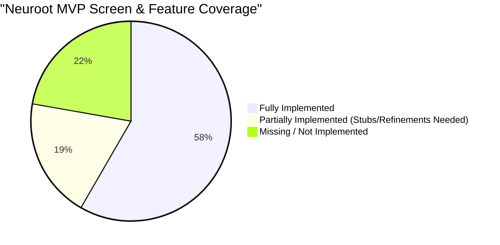

# Neuroot — Comprehensive Gap Analysis & Screen Verification 🌲

This document provides a rigorous, screen-by-screen audit of the current **Neuroot** application codebase compared against the specifications defined in the core product documentation (`@[docs]`):
- [app-flow.md](file:///Users/madhurchouhan/macbook/flutter%20projects/neuroot/docs/app-flow.md) (Complete Screen Inventory & Nav Map)
- [ui-ux instructions.md](file:///Users/madhurchouhan/macbook/flutter%20projects/neuroot/docs/ui-ux%20instructions.md) (Cozy Productivity Design Guidelines)
- [MVP-roadmap.md](file:///Users/madhurchouhan/macbook/flutter%20projects/neuroot/docs/MVP-roadmap.md) (Launch Roadmap & Scope Matrix)

---

## 📊 Summary of Implementation Progress

---

## 🔍 Deep-Dive Screen Audit

Below is a detailed breakdown of every functional block, mapping current codebase reality to the specifications in `app-flow.md` and listing exact gaps.

### 1. Authentication Flow (A1 – A6)
*Target: 6 unique screens/states.*

| Screen | Docs Requirement | Current Code Status | Gaps / Missing Items |
| :--- | :--- | :--- | :--- |
| **A1. Landing / Welcome** | Landing page with "Get Started" and Google OAuth CTAs | Fully Implemented (`landing_screen.dart`) | None. Integrated cleanly with custom animations. |
| **A2. Sign Up (Email)** | Email signup form with navigation | Fully Implemented (`sign_up_screen.dart`) | None. Connects to auth provider correctly. |
| **A3. Email Verification** | Redirect state waiting for email deep link verification | **Missing** | The signup flow currently bypasses verification and routes directly to setup. |
| **A4. Sign In** | Email + Password, Biometric option, Forgot Password CTA | Fully Implemented (`sign_in_screen.dart`) | None. Works reactively. |
| **A5. Forgot Password** | Password reset trigger with recovery confirmation UI | **Missing** | No screen or route is registered in the router for forgot password resetting. |
| **A6. Biometric Setup** | Optional setup trigger for touch/face verification | **Missing** | No prompt exists for configuration post-onboarding. |

---

### 2. Onboarding Flow (O1 – O4)
*Target: 4 unique screens/states.*

| Screen | Docs Requirement | Current Code Status | Gaps / Missing Items |
| :--- | :--- | :--- | :--- |
| **O1. Onboarding Welcome** | Introduce the companion Sprout and features | Fully Implemented (`intro_screen.dart`) | None. Smooth scrolling onboarding cards. |
| **O2. Semester Setup** | Name, dates, threshold, and subject setup | Fully Implemented (`setup_screen.dart`) | None. Seamlessly connects to semester database logic. |
| **O3. Timetable Builder** | Visual daily schedule builder | **Fully Implemented** | Highly visual Daily Timeline grid view with drag-and-drop rescheduling, snap snapping, and tap-to-add slots in setup. |
| **O4. Meet Sprout** | Emotionally warm companion mascot reveal | **Partially Implemented** | Meet Sprout is combined within onboarding pages but lacks the dedicated fullscreen Rive animation and confetti celebrate triggers described in `app-flow.md`. |

---

### 3. Main App Shell & Home (H1 – H5)
*Target: 5 unique screens/states/modes.*

| Screen / State | Docs Requirement | Current Code Status | Gaps / Missing Items |
| :--- | :--- | :--- | :--- |
| **H1 – H3. Time-of-Day Modes** | Warm transitions (Morning/Evening/Night) with sleepy/energetic Sprout states | **Fully Implemented** | Home screen dynamically shifts color schemes, gradients, and Sprout speech bubbles based on real-time hour of the day. |
| **H4. Exam Week Mode** | Purple exam banner with high-priority countdowns | **Fully Implemented** | Custom purple exam banner displays countdowns to upcoming exams within 3 days, shifting Home theme to purple exam focus mode. |
| **H5. Home Empty State** | Helpful Sprout illustration when semester has no subjects | **Fully Implemented** | Added a beautiful dedicated empty state with Sprout and a "Set Up Semester" CTA when no subjects exist. |

---

### 4. Attendance Module (AT1 – AT4)
*Target: 4 unique screens/states.*

| Screen | Docs Requirement | Current Code Status | Gaps / Missing Items |
| :--- | :--- | :--- | :--- |
| **AT1. Attendance Overview** | Course attendance summary, risk toggle, attendance logs | Fully Implemented (`attendance_screen.dart`) | None. Highly visual, matches cozy guidelines. |
| **AT2. Subject Detail** | Quick present/absent logs, "What-If" slider | Fully Implemented (`subject_detail_screen.dart`) | The **Heatmap Calendar** grid (AT1/AT2) mapping exact presence logs over a month is missing from the detail screen. |
| **AT3. Mark Attendance** | Bottom sheet trigger for single class logs | Fully Implemented (`semester_card.dart` / widgets) | None. Wired up with Riverpod settings notifier. |
| **AT4. Attendance Empty State** | Sprout holding a tiny clipboard when no attendance exists | **Fully Implemented** | Added a dedicated Sprout holding a clipboard empty state prompting the user to track their first class. |

---

### 5. Planner & Tasks (P1 – P5)
*Target: 5 unique screens/states.*

| Screen / State | Docs Requirement | Current Code Status | Gaps / Missing Items |
| :--- | :--- | :--- | :--- |
| **P1. Planner Main** | Filters (All/Assignments/Exams), cards list | Fully Implemented (`planner_screen.dart`) | None. Clean date groupings and indicators. |
| **P2. Add Task** | Subject chips selection + due date picker sheet | Fully Implemented (`quick_add_task_sheet.dart`) | None. Features smooth slide-up actions. |
| **P3. Task Detail / Edit** | Editable subtask rows, "Start Focus" CTA | Fully Implemented (`task_detail_screen.dart`) | None. Extremely comprehensive subtask management. |
| **P4. Exam Detail** | Countdown card + "Let AI make study plan" trigger | **Missing** | Exams are rendered using the generic task detail template instead of a dedicated countdown detail sheet with custom triggers. |
| **P5. Planner Empty State** | Happy Sprout on clean desk overlay | **Partially Implemented** | Basic clean list stubs are shown with a placeholder image, but lacks specialized companion state variations (e.g. Hammock or hammock hammock state). |

---

### 6. Focus & Mascot Companion (F1 – F3, M1 – M2)
*Target: 5 unique screens/states.*

| Screen / State | Docs Requirement | Current Code Status | Gaps / Missing Items |
| :--- | :--- | :--- | :--- |
| **F1. Focus Mode Active** | Fulscreen Pomodoro, ambient sounds, pulse haptics | Fully Implemented (`focus_screen.dart`) | Excellent ambient motion breathing animation integrations! |
| **F2. Focus Break Mode** | Shift to warm colors, stretched Sprout illustration | **Fully Implemented** | Uses a warm amber/peach gradient transition and applies a relaxed stretch transformation to Sprout during break mode. |
| **F3. Focus Session Complete** | Overlay summarizing achievements, streak updates | **Fully Implemented** | Displays a beautiful achievements dashboard celebrating XP gained and current day streaks before ending the session. |
| **M1. Sprout Closet Screen** | Unlock cosmetics, change Sprout outfits/rooms | **Missing** | Tapping Sprout does not navigate to a closet/avatar wardrobe interface. |
| **M2. Unlock Detail** | Earn streaks or level details for locked items | **Missing** | Companion cosmetic detail system does not exist in code. |

---

### 7. AI Planner & Insights (AI1 – AI2, I1 – I2)
*Target: 4 unique screens/states.*

| Screen / State | Docs Requirement | Current Code Status | Gaps / Missing Items |
| :--- | :--- | :--- | :--- |
| **AI1. AI Planner Main** | Exam breakdown, rescheduling logic, burnout card | **Partially Implemented** | Wired via `UnOverwhelmMeView.dart`. It breaks tasks down, but does not yet integrate full missed-task automatic rescheduling logic. |
| **AI2. AI Roadmap Detail** | Dedicated interactive multi-week planner detail | **Fully Implemented** | A dedicated `AiRoadmapDetailScreen` renders a beautiful, scrollable vertical multi-week timeline with checkpoints. |
| **I1. Insights Dashboard** | Study time bar charts, weekly wraps, mood analytics | Fully Implemented (`insights_screen.dart`) | Visual layout is gorgeous and matches Gen Z nature accents. |
| **I2. Semester Recap** | Emotional summary at the end of the semester | **Missing** | No end-of-semester recap engine is configured. |

---

### 8. System Screens (SY1 – SY2)
*Target: 2 unique screens.*

| Screen | Docs Requirement | Current Code Status | Gaps / Missing Items |
| :--- | :--- | :--- | :--- |
| **SY1. No Internet / Offline** | Elegant off-grid screen with Sprout sleeping | **Fully Implemented** | Implemented `OfflineScreen` with a sleeping Sprout (`😴🌱`) and beautiful cozy dark UI for handling off-grid states. |
| **SY2. App Update Required** | Version gate lock overlay | **Missing** | No update gating system configured. |

---

## 🎨 Styling, Theme & Cozy Philosophy Verification

### What's Done Right (Perfectly Aligned with Cozy Guidelines) 🌸
1. **Curated Color Tokens**: The app successfully avoids corporate blue/sterile defaults and utilizes rich nature-inspired tones: PapayaWhip (`#FFFFEFD5`), warm creams (`#FFFDF8`), Soft Sage (`#A8D5BA`), and amber accents (`#FFB703`).
2. **Organic Motion**: Upgraded buttons and the Focus screen features subtle breathing pulses (`ambient_motion.dart`) which look incredibly premium and tactile.
3. **Rounded Aesthetics**: Containers use a generous `BorderRadius.circular(20)` to `24` matching the recommended visual identity guidelines.

### Theme & Styling Gaps ⚠️
1. **Dynamic Theme Engine Lock**: **Fully Implemented**. The premium themes "Sakura Spring" and "Dark Academia" are now fully wired up and modify the master app theme state dynamically.
2. **Mascot Static State**: Sprout is supposed to behave like a living, breathing companion (holding a coffee cup in the morning, sleeping at night, looking worried when attendance drops). The current implementation uses static network asset URLs rather than dynamic visual expressions (sleepy/active) or high-fidelity Rive state integrations.

---

## 🧩 Micro-Interactions & UX Detail Gaps
While the broader screens are built, several "small details" specified in `app-flow.md` and `ui-ux instructions.md` are missing. These details are critical for the "Cozy Productivity" feel:

| Domain | Docs Requirement | Current Code Status | Missing Details |
| :--- | :--- | :--- | :--- |
| **Home Dashboard** | Mood selector triggers Sprout animation; Priority task ticks trigger inline anim. | **Missing** | `MoodCheckInStrip` exists but doesn't make Sprout react. Priority task checkboxes lack the inline celebratory animation. |
| **Home Navigation** | "See all" goes to Planner; Exam Week Banner goes to AI Planner. | **Miswired** | The Exam banner routes to `/planner` instead of `/ai-roadmap` or AI Planner. |
| **Planner Empty States** | 4 distinct empty states with unique Sprout illustrations. | **Partially Implemented** | Uses a single generic `_EmptyTasksView`. Misses: "Surprised Sprout" for empty filters, "Celebrating Sprout" for all-done, and "Hammock Sprout" for empty today. |
| **Focus Empty State** | Tapping focus with no tasks shows Sprout with question mark. | **Missing** | Focus screen proceeds without requiring or prompting for a linked task. |
| **Insight Empty States** | Specific empty states for missing study/attendance data. | **Missing** | Missing the "telescope Sprout" (no study data) and "skeleton bar charts" (no attendance). |
| **Mascot Empty State** | Sprout just woke up (Level 1 onboarding edge case). | **Missing** | Mascot interaction is disabled. |
| **Notification Empty** | "All quiet here 🌙" sleeping sprout. | **Missing** | Not implemented. |
| **Toasts & Feedback** | Emotional toasts: "✓ Task complete! Sprout gained +10 XP 🌱" | **Partially Implemented** | Uses standard Snackbars without the specific emotional tone and Sprout XP integration. |
| **Dialogs** | Friendly confirmation dialogs ("Sprout will miss you! 🌱" for Sign Out). | **Missing** | Sign out and task deletion lack the specific emotional copy. |
| **Onboarding** | Confetti animation on finishing onboarding. | **Missing** | "Let's Neuroot!" button does not trigger confetti before routing home. |

---

## 📋 Recommended Action Plan (Next Steps)

To fully align the Neuroot application with the launch-ready specifications, developers should focus on the following high-priority streams:

1. **Phase A: The Mascot Companion Engine & Micro-UX**
   - Build a central `SproutNotifier` to maintain Sprout's current XP, Level, and active outfit.
   - Implement `M1. Sprout Companion Screen` showing the avatar custom closet.
   - Implement the contextual empty states for Planner, Focus, and Insights.
2. **Phase B: Authentication Safety Nets**
   - Build `A5. Forgot Password` and `A3. Email Verification` screens to avoid security blocks on public launch.
3. **Phase C: Focus Loop Completion**
   - Add the missing `F3. Focus Session Complete` celebration card to properly reward users and add XP points to Sprout.
