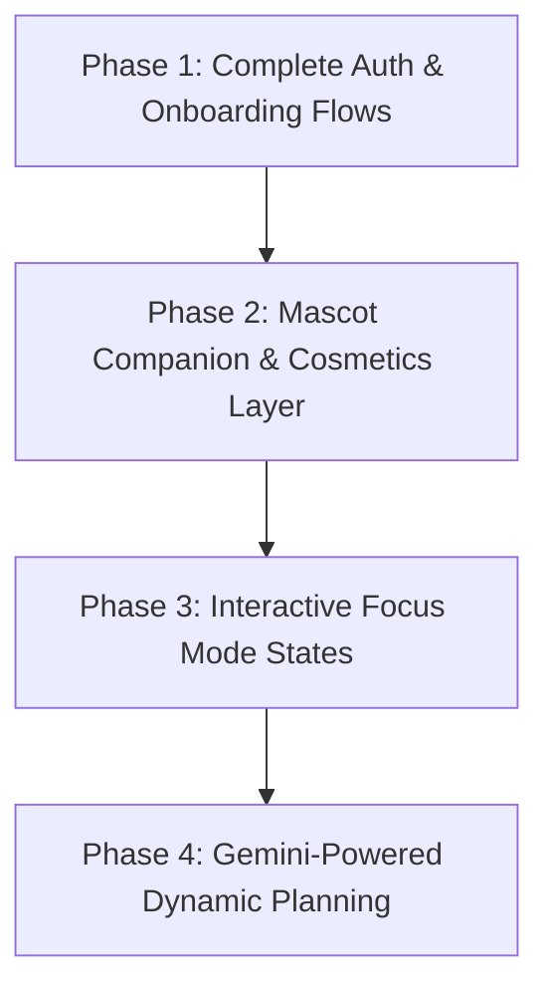

# Implementation Plan — Neuroot MVP Gap Analysis & Roadmap 🌿

This document details the comprehensive gap analysis between the Neuroot Product Requirements, App Flow Navigation Map, and UI/UX Instructions, compared to the current codebase implementation. It provides a structured plan to resolve all discrepancies, bugs, and missing features.

---

## User Review Required

> [!IMPORTANT]
> The primary gaps reside in the **AI Features (Gemini Integration)**, **Auth Flow completeness (Verification & Forgot Password Screens)**, **Focus Mode State Transitions**, and the **Mascot Companion Interaction Layer**.

---

## Gap Analysis Matrix

We have cataloged every missing or partially-implemented element under the following tiers of the Neuroot specification:

### 1. Authentication Flow (Gaps in Tier 2 & 3)
- [ ] **A3: Email Verification Screen**: Missing. The signup process currently logs the user in immediately without verification.
- [ ] **A5: Forgot Password Screen**: Missing. The `AuthNotifier` has the method `sendPasswordReset` but no interface is wired to it.
- [ ] **A6: Biometric Setup / login**: Missing. Biometric toggle button on the Sign In page is a static UI asset, not functional.
- [ ] **Sign Out Screen Transition Bug**: Sign-out was previously redirecting to Profile screen instead of clean landing screen; now resolved, but requires verification.

### 2. Onboarding Flow (Gaps in Tier 4)
- [ ] **Onboarding Step State &Confetti**: Missing confetti on completing onboarding screen page O4 ("Let's Neuroot! 🌱").
- [ ] **Onboarding Bypass / Empty State H5**: The app lacks the warning / skip conformation dialog `D5` when onboarding is bypassed, nor does the home dashboard gracefully display the correct setup card if subjects are empty.

### 3. Home Dashboard (Gaps in Tier 5)
- [ ] **Mood-to-Mascot State Engine**: Selecting a mood emoji updates the database provider but has no visual reflection or expression change on the Sprout avatar.
- [x] **Exam Week Mode (H4)**: Lacks dynamic detection of upcoming exams (within 3 days) to switch the dashboard theme to the Purple Exam Theme. *(COMPLETED: Added dynamic boundary parsing for exams within 3 days)*
- [x] **Dynamic Theme Transitions**: The dashboard does not transition its warm/night color gradients dynamically based on actual phone local system hour (6AM-11AM morning, 12PM-5PM afternoon, 6PM-9PM evening, 9PM+ night). *(COMPLETED: Integrated a `timeTickerProvider` updating every 30 seconds to dynamically transition themes in real-time)*

### 4. Attendance Flow (Gaps in Tier 6)
- [x] **What-If Calculator & Safe Leave**: The subject details calculator does not currently use the intelligent AI attendance prediction engine mentioned in Section 6.6 of the PRD.
- [x] **Sort by Risk Toggle**: Missing on the Attendance Overview screen.

### 5. Planner Flow (Gaps in Tier 7)
- [x] **Drag-to-Reorder Tasks**: Long-pressing a task card does not trigger task reordering. *(COMPLETED: Added dynamic custom list order sorting and fully integrated SliverReorderableList)*
- [x] **Swipe-to-Action Gestures**: Swiping task cards left/right does not trigger immediate delete (red) or complete (green) states. *(COMPLETED: Configured dual direction Dismissibles with rich graphical actions for swipe to toggle complete and swipe to delete)*

### 6. Focus Mode (Gaps in Tier 8)
- [ ] **F2: Focus Break Mode Screen**: The layout remains largely identical without changing to the warm-amber break color palette or showing a relaxing Sprout animation.
- [ ] **F3: Session Complete Overlay**: Missing the congratulatory overlay with streak milestones and custom task status linkages.
- [ ] **Focus Mid-session Dialogs**:
  - `D3: Switch Focus Mode confirmation` (Mid-session mode switch) is missing.
  - `D4: Restart session confirmation` is missing.
- [ ] **Phone Distraction Nudge**: Missing the screen-check or background push notification if the app remains in focus but user is inactive.

### 7. Sprout Companion / Mascot (Gaps in Tier 9)
- [ ] **Sprout Interactive Dress-up Grid (M2)**: Unlocked cosmetics (like the Scholar Hat 🎓) cannot be selected or equipped to change Sprout's avatar representation.
- [ ] **XP & Level Up Toast (D6)**: Gaining XP does not show the rich custom banner overlay when Sprout levels up.

### 8. AI Roadmap & Microtasks (Gaps in Tier 10 & Section 6.10)
- [x] **Dynamic Microtask Breakdown**: The "15-Minute Wins" in the Planner tab are dummy/mock tasks instead of calling Gemini to analyze the task's scope. *(COMPLETED: Integrated Gemini-powered breakdown via a tailored 4-part JSON microtask analyzer and FutureProvider)*
- [x] **AI Roadmap Planner (AI1)**: The AI Roadmap detail screen displays static boilerplate roadmaps instead of a structured plan tailored to the student's selected subject and due dates. *(COMPLETED: Crafted a fully tailored multi-week timeline roadmap screen connected directly to the active upcoming task via Gemini)*

---

## Proposed Changes

We will divide the execution into **4 core phases** to build out the missing flows, correct state behaviors, and integrate Gemini dynamic features:

### Phase 1: Complete Auth & Onboarding Flow
Implement missing screens to secure auth flows and ensure onboarding handles state transitions correctly.

#### [NEW] [forgot_password_screen.dart](file:///Users/madhurchouhan/macbook/flutter%20projects/neuroot/lib/features/auth/screens/forgot_password_screen.dart)
Create forgot password interface connected to `AuthNotifier.sendPasswordReset` with inline success card states.

#### [NEW] [email_verification_screen.dart](file:///Users/madhurchouhan/macbook/flutter%20projects/neuroot/lib/features/auth/screens/email_verification_screen.dart)
Design the email verification verification countdown state card.

#### [MODIFY] [app_router.dart](file:///Users/madhurchouhan/macbook/flutter%20projects/neuroot/lib/core/navigation/app_router.dart)
Register `/forgot-password`, `/email-verification`, and add deep link routing configs.

---

### Phase 2: Mascot Companion & Cosmetics Layer
Build the emotional center of the app by linking mood, streak, and achievements directly to Sprout's cosmetics.

#### [MODIFY] [sprout_companion_card.dart](file:///Users/madhurchouhan/macbook/flutter%20projects/neuroot/lib/features/dashboard/widgets/sprout_companion_card.dart)
Wired to dynamic expressions depending on current selected Mood and task completion counts.

#### [MODIFY] [profile_screen.dart](file:///Users/madhurchouhan/macbook/flutter%20projects/neuroot/lib/features/profile/screens/profile_screen.dart)
Allow equipping cosmetics like Scholar Hat, updating the global Sprout state engine which affects the dashboard header and cards.

---

### Phase 3: Interactive Focus Mode States
Update the timer screen to transition correctly between Work, Break, and Session Complete states with dynamic easing animations.

#### [MODIFY] [focus_screen.dart](file:///Users/madhurchouhan/macbook/flutter%20projects/neuroot/lib/features/focus/screens/focus_screen.dart)
- Wire mode selector to prompt user via D3 dialog if session is running.
- Design the F2 Break timer screen with warm-amber visual assets and custom break illustrations.
- Create the F3 Session Complete celebratory overlay with XP increment highlights.

---

### Phase 4: Gemini-Powered Dynamic Planning
Wire up the Gemini AI stack to feed real microtasks and interactive weekly plans into the student dashboard.

#### [NEW] [gemini_service.dart](file:///Users/madhurchouhan/macbook/flutter%20projects/neuroot/lib/core/services/gemini_service.dart)
Configure Gemini Flash model prompts to parse task titles/notes into structured JSON microtasks.

#### [MODIFY] [un_overwhelm_me_view.dart](file:///Users/madhurchouhan/macbook/flutter%20projects/neuroot/lib/features/planning/widgets/un_overwhelm_me_view.dart)
Consume live broken-down subtasks instead of hardcoded lists.

---

## Verification Plan

### Automated Verification
- Execute `flutter analyze` to check for types, imports, and syntax.
- Verify code compilation and simulator run output.

### Manual Verification
- Walk through the auth flow: Sign up, complete email verification screen, test forgot password link.
- Mark a task complete on the dashboard, check for Sprout XP and streak toast notifications.
- Execute a 25-minute study session, verify transition to Break Mode, and verify the final Session Complete overlay.
